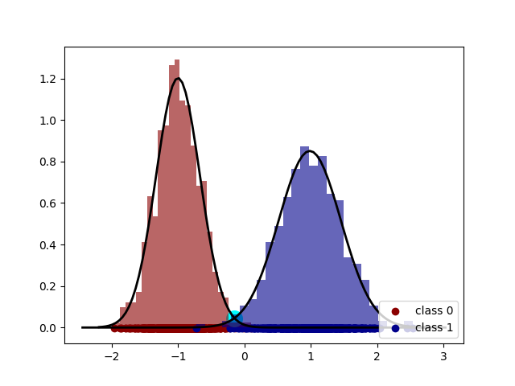

# Linear Discriminant Analysis

The objective of this project is to implement Fisher's Linear Discriminant for dimensionality reduction. Further, after projection into a smaller space, a classification model is built by estimating the smaller dimensional Gaussian distribution from which each class is drawn.

The model was trained and tested on 2 datasets and can be found in `data/`.
- `data2D.npy` contains 2-dimensional data and 2 classes (binary classification)
- `data3D.npy` contains 3-dimensional data and 2 classes (binary classification)

Each of these is reduced to 1 dimension for classification using the discriminant made.
The 1D Gaussian is estimated using maximum likelihood estimation and the classifier threshold is found by intersecting the two Gaussians (corresponding to each class). Intersection point for Gaussians is found using binary search.

#### Model Description

The model is defined in `fisher_discriminant.py` as `Model`.

## Experiments

To evaluate the robustness of this method, the dataset is split into train and test sets in the ratio 0.8:0.2 respectively. No validation set is required because there are no hyperparameters to be tuned.

The projection direction and classification threshold were found using the train set and the test set was classified was projected to this dimension and classified using the estimated threshold. The results and some plots are summarized later in this document.

#### Metrics Used
**Accuracy** is calculated as the percentage of correctly classified samples.
**F-score** is calculated as the harmonic mean of precision and recall, where:
- precision is calculated as ratio of true positives and predicted positives
- recall is calculated as ratio of true positives and actual positives

#### Figures

- <i>Left hand side figures show the data plotted in reduced dimensions (for 2D data, original scatterplot is also shown).
- Right hand side figures show the Gaussians obtained along the projected dimension. The intersection of the Gaussians is highlighted in cyan.</i>

|data2D.npy|data2D.npy|
|--|--|
||

|data3D.npy|data3D.npy|
|--|--|
||

#### Results

Data|Accuracy|F-Score
----|----|---|
data2D.npy|99.5|0.995
data3D.npy|100.0|1.0

#### Conclusions

- Both the datasets reveal that the model performs well.
- The high accuracy reveals that the orginial data had a well defined linear discriminant along which the data could be sepearated into respective classes.