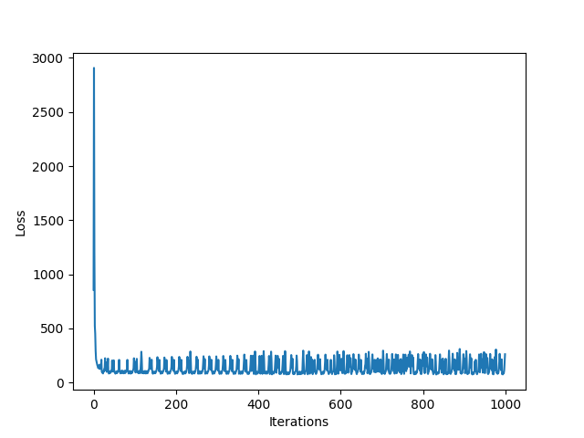
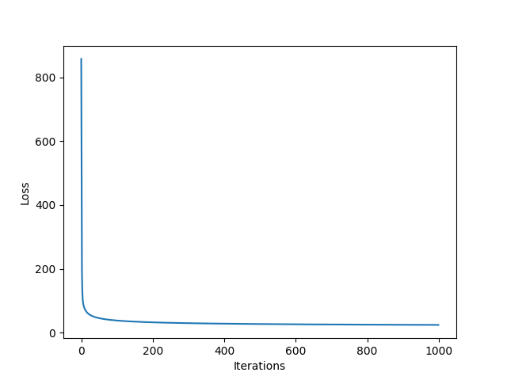
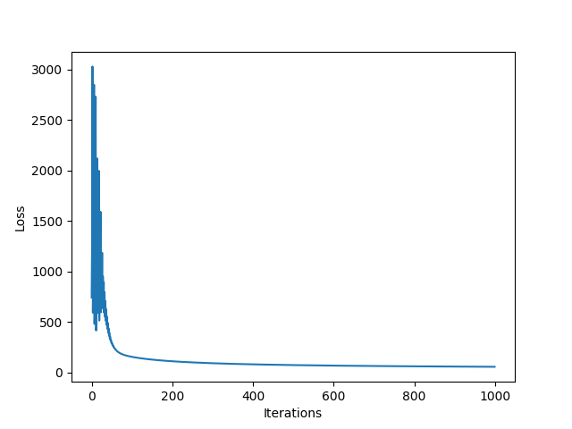

# Logistic Regression

The objective of this project is to implement a logistic regression model from scratch to identify forged bank notes.
The dataset used can be found <a href="https://archive.ics.uci.edu/ml/datasets/banknote+authentication">here</a>.

The input data contains features extracted using wavelet extraction tools from bank note images. It
contains 4 defining features and 1 classification attribute. The dataset contains 1372 instances.

### Model Description

The model is defined in `logistic_regression.py` as `Model`.

#### Hyperparameters
- **Initialization**: zero initialization, random initialization (Gaussian or Uniform)
- **Regularization**: L1, L2, None
- Maximum number of iterations
- Learning rate
- **Loss function**: cross entropy

#### Metrics Used
**Accuracy** is calculated as the percentage of correctly classified samples.
**F1-score** is calculated as the harmonic mean of precision and recall, where:
- precision is calculated as ratio of true positives and predicted positives
- recall is calculated as ratio of true positives and actual positives

### Experiments

1. The samples were shuffled and split into **train-validation-test** sets in the ratios 0.7:0.15:0.15.
2. Before training any model, the samples were **normalized** using min-max normalization or standardization using the set's own statistics.
3. Several experiments were performed for searching the best hyperparameters for classification.

While experimenting, the hyperparameters that were tuned were:
- Type of regularization
- Learning Rate
- Number of iterations during training
- Type of initialization

#### Summary

|Name|Normalization|Learning Rate|Regularization|Lambda|Initialization|Number of Iterations|Training Accuracy|Validation Accuracy|Validation F1-score|
|--|--|--|--|--|--|--|--|--|--|
**Model 1**|Standardization|0.01|L2|0.01|Gaussian|1,000|97.8|99.5|0.995|
**Model 2**|Standardization|0.01|L2|1|Gaussian|10,000|97.8|99.5|0.995|
**Model 3**|Standardization|0.01|L1|1|Gaussian|1,000|98.6|99.0|0.99|
**Model 4**|Standardization|1|None|-|Gaussian|1,000|98.5|98.5|0.98|
**Model 5**|Standardization|0.01|None|-|Gaussian|1,000|98.4|99.0|0.99|
**Model 6**|Min-Max|0.01|None|-|Gaussian|1,000|97.8|99.5|0.995|
**Model 7**|Standardization|0.01|None|-|Uniform|1,000|98.4|99.0|0.99|

#### Plots

|Loss Function Model 4|Loss Function Model 5|Loss Function Model 6|
|--|--|--|
|||

#### Parameters

|Param.|Model 2|Model 3|Model 4|Model 5
|--|--|--|--|--|
|**w1**| -4.6|-7.60|-192.59|-11.27
|**w2**| -4.5|-8.13|-201.1|-12.23
|**w3**| -4.13|-7.39|-176.36|-11.15
|**w4**|0.157|-0.0037|-16.69|-0.38
|**b**| -1.63|-3.53|-87.07|-5.69

#### Analysis
- All models (using tuned hyperparameters) seem to have learned the underlying general patterns well as all of them give ~99% validation accuracies.
- Standardization does better than Min-Max normalization because the former can normalize the features such that their means and variances all match (hence, leading to symmetric & smooth learning) whereas the latter only brings the features to the same range.
- High learning rates (Model 4) confuses the model during training which causes it to search for arbitrarily large parameters.
- Regularization provides gains both in terms of preventing overfitting and finding smaller more interpretable parameters for the model; L1 regularization does feature engineering and almost zeroes out irrelevant features while L2 regularization provides a stricter means to regularize the magnitude of parameters.
- On observing the parameters, it can be concluded that feature 4 has little or no importance to the prediction of classes; features 1, 2 and 3 have a high negative correlation (almost same for all features) in determining the correct class.
- Changing the mode of initialization of weights does not affect the model's performance in this case.