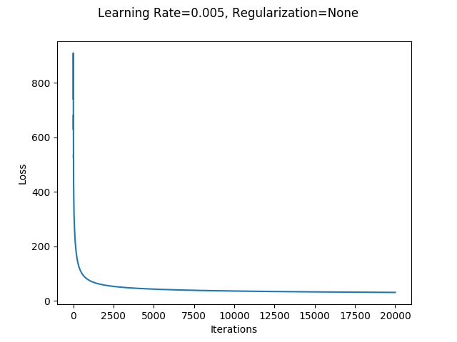
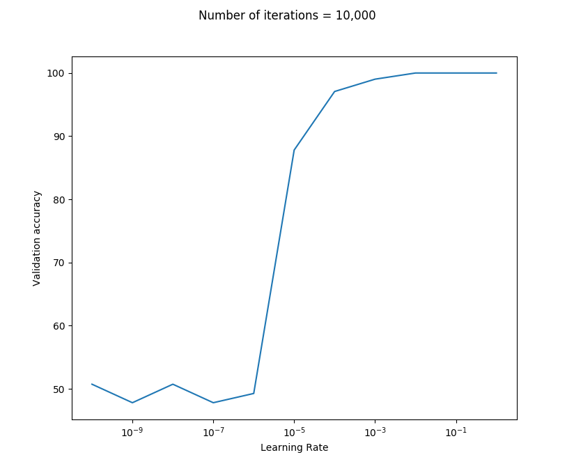

# Logistic Regression

The objective of this project is to implement a logistic regression model from scratch to identify forged bank notes.
The dataset used can be found <a href="https://archive.ics.uci.edu/ml/datasets/banknote+authentication">here</a>.

The input data contains features extracted using wavelet extraction tools from bank note images. It
contains 4 defining features and 1 classification attribute. The dataset contains 1372 instances.

### Model Description

The model is defined in `logistic_regression.py` as `Model`.

#### Hyperparameters
- **Initialization**: zero initialization, random initialization
- **Regularization**: L1, L2, None
- Maximum number of iterations
- Learning rate
- **Loss function**: cross entropy

#### Metrics Used
**Accuracy** is calculated as the percentage of correctly classified samples.
**F-score** is calculated as the harmonic mean of precision and recall, where:
- precision is calculated as ratio of true positives and predicted positives
- recall is calculated as ratio of true positives and actual positives

### Experiments

1. Before training any model, the samples were **normalized** using min-max normalization or standardization. 
2. After normalizations, the samples were shuffled and split into **train-validation-test** sets in the ratios 0.7:0.15:0.15.
3. Several experiments were performed for searching the best hyperparameters for classification.

While experimenting, the hyperparameters that were tuned were:
- Type of regularization
- Learning Rate
- Number of iterations during training
- Type of initialization

#### Plots

|Loss Function|
---
|</img>|

|Learning Rate (Similar for L1 and L2)|
---
|</img>|

#### Summary

|Name|Learning Rate|Regularization|Lambda|Initialization|Number of Iterations|Training Accuracy|Validation Accuracy|Validation F-score|
|--|--|--|--|--|--|--|--|--|
**Model 1**|0.01|L2|0.01|Random|10,000|98.65|100.0|1.0|
**Model 2**|0.1|L1|0.001|Random|10,000|98.96|100.0|1.0|
**Model 3**|0.005|None|-|Random|20,000|98.65|100.0|1.0|
**Model 4**|0.005|None|-|Zero|20,000|98.65|100.0|1.0|

#### Analysis
- All models (using tuned hyperparameters) seem to have learned the underlying general patterns well as all of them give 100% validation accuracies.
- The parameters learned for Model 3 are:

|Param.|Value|
|--|--|
|**w1**| -14.2|
|**w2**| -15.68|
|**w3**| -14.33|
|**w4**|-0.71|
|**b**| -7.08|
- This indicates that features w1, w2 and w3 have a relatively stronger negative impact in determining the class whereas w4 has relatively low or no impact. These values can be thus compared because they were normalized and have more or less the same means and variances.