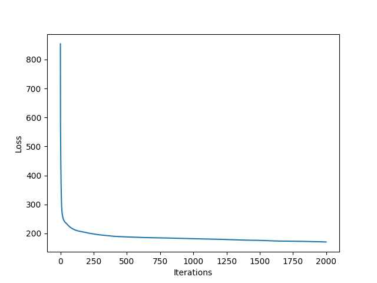
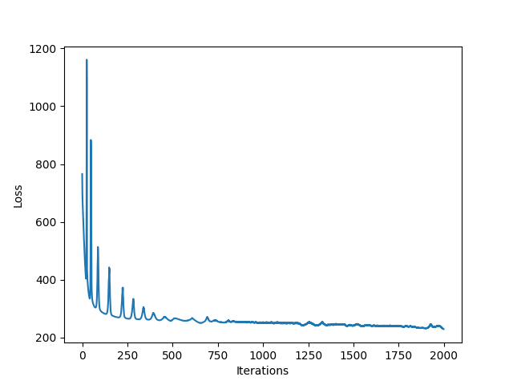
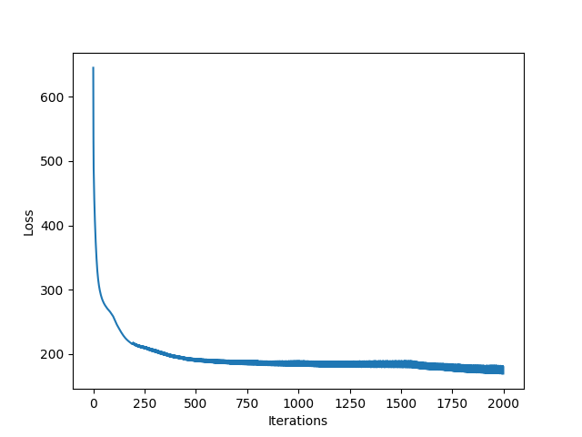

# Neural Networks

The objective of this project is to implement a nerual network model from scratch. The data used can be found in `data/`. It contains 10 defining features and 1 classification attribute (0/1). The dataset contains 1460 instances.

### Model Description

The model is defined in `neural_network.py` as `Model`.

#### Hyperparameters
- **Neural network architecture**: number of hidden layers, number of units in each hidden layer
- **Activation functions**: can be specified differently for each layer; ReLU or tanh or sigmoid
- **Initialization**: `gaussiain` or `uniform` or `He`
- **Regularization**: None
- Maximum number of iterations
- Learning rate
- **Loss function**: cross entropy
<i> (seed for np.random = 42) </i>

#### Metrics Used
**Accuracy** is calculated as the percentage of correctly classified samples.
**F-score** is calculated as the harmonic mean of precision and recall, where:
- precision is calculated as ratio of true positives and predicted positives
- recall is calculated as ratio of true positives and actual positives

### Experiments

1. Before training any model, the samples were **normalized** using min-max normalization or standardization. 
2. After normalizations, the samples were shuffled and split into **train-validation-test** sets in the ratios 0.7:0.15:0.15.
3. Several experiments were performed for searching the best hyperparameters for classification.

While experimenting, the hyperparameters that were tuned were:
- Number of hidden layers
- Number of units in each hidden layer
- Activation functions for each hidden layer
- Learning Rate
- Number of iterations during training

#### Summary

Name|Normalization|Learning Rate|Architecture|Activation Functions|Initialization|Number of Iterations|Training Accuracy|Validation Accuracy|Validation F1-score|
|--|--|--|--|--|--|--|--|--|--|
Model 0| Standardization|0.001|[10, 1]|['sigmoid']|He|2,000|90.5|89.0|0.89|
Model 1| Standardization|0.001|[10, 8, 1]|['relu', 'sigmoid']|He|2,000|93.6|90.4|0.90|
Model 2| Standardization|0.001|[10, 8, 1]|['tanh', 'sigmoid']|He|2,000|96.0|90.9|0.91|
Model 3| Standardization|0.001|[10, 8, 1]|['relu', 'sigmoid']|Gaussian|2,000|93.6|89.95|0.9|
Model 4| Standardization|0.001|[10, 8, 1]|['tanh', 'sigmoid']|Gaussian|2,000|94.5|89.95|0.9|
Model 5| Standardization|0.0001|[10, 18, 1]|['relu', 'sigmoid']|He|3,000|92.8|90.9|0.91|
Model 6| Standardization|0.0001|[10, 18, 1]|['tanh', 'sigmoid']|He|3,000|92.46|89.5|0.89|
Model 7| Standardization|0.001|[10, 6, 3, 1]|['relu', 'relu', 'sigmoid']|He|2,000|93.5|90.9|0.91|
Model 8| Standardization|0.001|[10, 6, 3, 1]|['tanh', 'tanh', 'sigmoid']|He|2,000|96.6|89.95|0.9|
Model 9| Standardization|0.0001|[10, 5, 5, 5, 1]|['relu', 'relu', 'relu', 'sigmoid']|He|3,000|92.7|90.86|0.90|
Model 10| Standardization|0.0001|[10, 5, 5, 5, 1]|['tanh', 'tanh', 'tanh', 'sigmoid']|He|3,000|93.2|89.95|0.90|
Model 11| Standardization|0.0001|[10, 15, 10, 5, 1]|['tanh', 'tanh', 'tanh', 'sigmoid']|Gaussian|8,000|99.3|87.7|84.0|
Model 12| Standardization|0.01|[10, 8, 1]|['relu', 'sigmoid']|He|2,000|77.23|79.0|0.82|
Model 13| Standardization|0.001|[10, 8, 1]|['relu', 'sigmoid']|He|10,000|94.13|87.7|0.87|
Model 14| Min-Max|0.001|[10, 8, 1]|['relu', 'sigmoid']|He|2,000|91.0|90.9|0.9|
Model 15| Standardization|0.001|[10, 8, 1]|['relu', 'sigmoid']|Uniform|2,000|93.3|89.95|0.9|

Best Model: **Model 5**
**Test Accuracy: 92.24**
**Test F1-score: 0.925**

#### Plots

|Loss Function Model 1|Loss Function Model 14|Loss Function Model 15|
|--|--|--|
|||

#### Analysis

- Deep neural networks can be made to overfit the data by giving sufficient depth and training for enough iterations.
- For the same model, He initialization leads to better learning than Gaussian initialization.
- For this dataset, deep neural networks do not provide significant gains over shallow neural networks; shallow neural networks do not provide significant gains over linear classification model (logisitic regression - Model 0).
- As seen in the figures above, all other hyperparameters kept constant, Min-Max normalization and Uniform initialization lead to unstable learning and require the learning rate to be decreased to provide better convergence; even on doing so they do not provide much gains (not tabulated above).