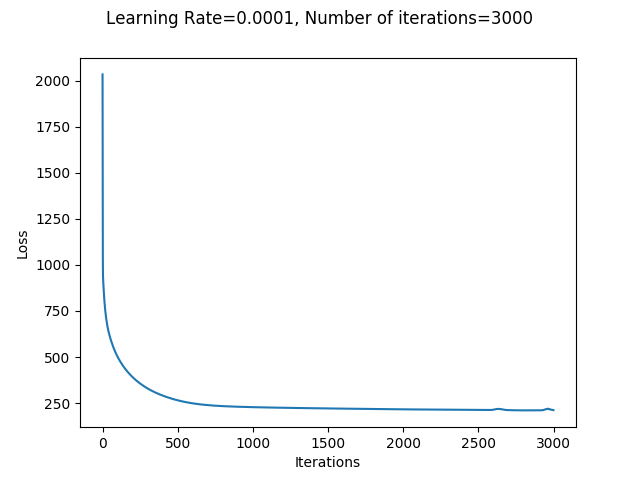

# Neural Networks

The objective of this project is to implement a nerual network model from scratch. The data used can be found in `data/`. It contains 10 defining features and 1 classification attribute. The dataset contains 1460 instances.

### Model Description

The model is defined in `neural_network.py` as `Model`.

#### Hyperparameters
- **Neural network architecture**: number of hidden layers, number of units in each hidden layer
- **Activation functions**: can be specified differently for each layer; ReLU or tanh or sigmoid
- **Initialization**: random initialization
- **Regularization**: None
- Maximum number of iterations
- Learning rate
- **Loss function**: cross entropy

#### Metrics Used
**Accuracy** is calculated as the percentage of correctly classified samples.
**F-score** is calculated as the harmonic mean of precision and recall, where:
- precision is calculated as ratio of true positives and predicted positives
- recall is calculated as ratio of true positives and actual positives

### Experiments

1. Before training any model, the samples were **normalized** using min-max normalization or standardization. 
2. After normalizations, the samples were shuffled and split into **train-validation-test** sets in the ratios 0.7:0.15:0.15.
3. Several experiments were performed for searching the best hyperparameters for classification.

While experimenting, the hyperparameters that were tuned were:
- Number of hidden layers
- Number of units in each hidden layer
- Activation functions for each hidden layer
- Learning Rate
- Number of iterations during training

#### Plots

|Loss Function|
---
|</img>|

#### Summary

|Name|Normalization|Learning Rate|Architecture|Activation Functions|Initialization|Number of Iterations|Training Accuracy|Validation Accuracy|Validation F-score|
|--|--|--|--|--|--|--|--|--|--|
Model 0|standardization|0.01|[10, 1]|[None, 'sigmoid']|Random (scaled by 0.01), Zero (for bias)|2,000|90.5|89.9|0.90
Model 1|min-max|0.00002|[10, 7, 6, 1]|[None, 'relu', 'relu', 'sigmoid']|Random|15,000|90.70|90.87|0.91|
Model 2|min-max|0.00002|[10, 7, 6, 1]|[None, 'tanh', 'relu', 'sigmoid']|Random|15,000|90.50|88.13|0.88|
Model 3|min-max|0.00002|[10, 7, 6, 1]|[None, 'relu', 'tanh', 'sigmoid']|Random|20,000|90.50|89.95|0.90|
Model 4|min-max|0.0001|[10, 7, 6, 1]|[None, 'relu', 'relu', 'sigmoid']|Random|5,000|90.31|91.78|0.92|
Model 5|min-max|0.001|[10, 7, 1]|[None, 'relu', 'sigmoid']|Random|17,000|91.00|90.41|0.91|
Model 6|min-max|0.002|[10, 7, 1]|[None, 'tanh', 'sigmoid']|Random|25,000|94.42|89.95|0.90
Model 7|min-max|0.0001|[10, 7, 6, 4, 1]|[None, 'tanh', 'tanh','tanh','sigmoid']|Random|15,000|92.5|90.4|0.90
Model 8|min-max|Adaptive*|[10, 4, 4, 4, 1]|[None, 'tanh', 'tanh','tanh','sigmoid']|Random|30,000|92.1|90.9|0.91
Model 9|standardization|0.0001|[10, 7, 1]|[None, 'tanh','sigmoid']|Random (scaled by 0.01), Zero (for bias)|15,000|92.5|90.4|0.90
Model 10|standardization|0.0001|[10, 7, 1]|[None, 'relu','sigmoid']|Random (scaled by 0.01), Zero (for bias)|15,000|92.76|89.04|0.89
Model 11|standardization|0.0001|[10, 15, 1]|[None, 'tanh','sigmoid']|Random (scaled by 0.01), Zero (for bias)|20,000|97.16|88.12|0.88
Model 12|standardization|0.0001|[10, 15, 1]|[None, 'relu','sigmoid']|Random (scaled by 0.01), Zero (for bias)|20,000|92.66|91.32|0.91
Model 13|standardization|0.001|[10, 25, 1]|[None, 'relu','sigmoid']|Random (scaled by 1/sqrt(n[i])), Zero (for bias)|10,000|99.4|89.04|0.89
Model 13|standardization|0.0001|[10, 18, 1]|[None, 'relu','sigmoid']|Random (scaled by 1/sqrt(n[i])), Zero (for bias)|5,000|94.5|91.78|0.92
Model 14|standardization|0.0001|[10, 18, 1]|[None, 'tanh','sigmoid']|Random (scaled by 1/sqrt(n[i])), Zero (for bias)|5,000|95.2|90.9|0.91

###### *Learning Rate reduced by a factor of 10 towards the end of learning

#### Analysis